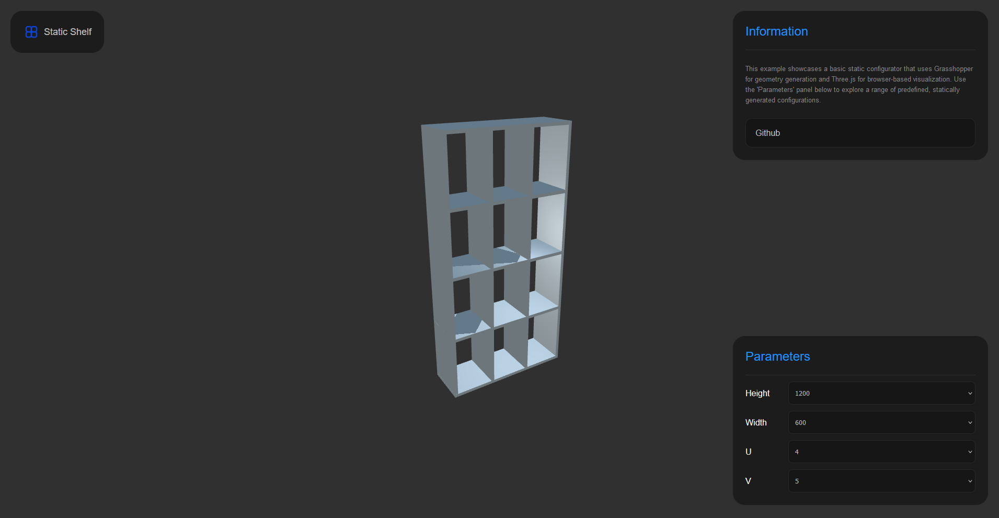
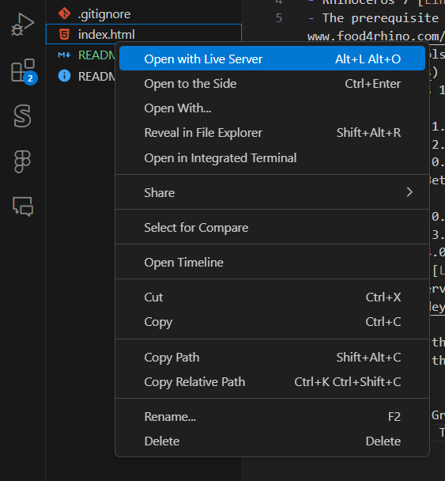

# Static Shelf

This example showcases a basic static configurator that uses Grasshopper for geometry generation and Three.js for browser-based visualization. This example is simplified to be more accessible for beginners, and it is meant to be used as an aid to teaching Grasshopper for the Web as part of the UCL MArch design courses.

# Setting up the environment

Before we start developing we first need to setup the following element on our machine:
- Rhinoceros 7 [Link](https://www.rhino3d.com/7/)
- The prerequisite plugins and packages from Food 4 Rhino [Link](https://www.food4rhino.com/en)
    - Ladybug Tools 1.8.0 [Link](https://www.food4rhino.com/en/app/ladybug-tools)
    - Triceratops 1.0.0 [Link](https://www.food4rhino.com/en/app/triceratops)
    - Swiftlet 0.1.9 [Link](https://www.food4rhino.com/en/app/swiftlet)
    - LunchBox 2.2.0 [Link](https://www.food4rhino.com/en/app/lunchbox)
    - Meshedit 2.0.0 [Link](https://www.food4rhino.com/en/app/meshedit)
    - EleFront (Beta) 5.1.2 [Link](https://www.food4rhino.com/en/app/elefront)
    - WeaverBird 0.9.0 (Rhino Package Manager)
    - Pufferfish 3.0.0 [Link](https://www.food4rhino.com/en/app/pufferfish)
    - Anemone 0.4.0 [Link](https://www.food4rhino.com/en/app/anemone)
- VS Studio Code [Link](https://code.visualstudio.com/download)
- VS Code Live Server [Link](https://marketplace.visualstudio.com/items?itemName=ritwickdey.LiveServer)

After installing those packages you will be able to run the Grasshopper scripts and open the code definitions. To run the web files I recommend using Live Server or any equivalen plugin. To use, simply right-click and `Open with Live Server`:

